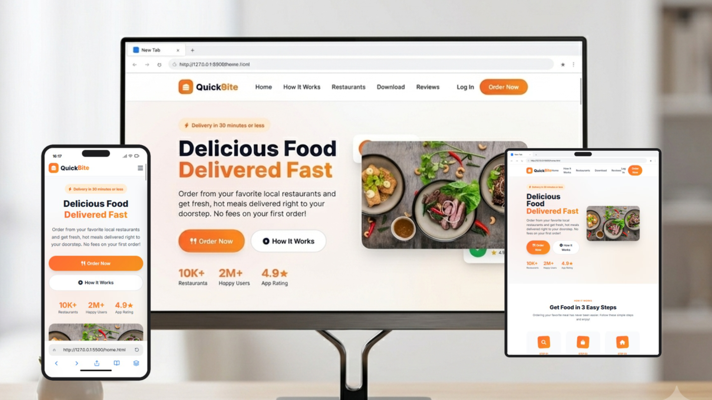

# QuickBite - Food Delivery Website

**QuickBite** is a modern, responsive food delivery web application that lets users browse restaurants, place orders, track deliveries in real-time, and grab the best deals.

## 🚀 Features

### Core Pages
- **Home** - Hero section, featured restaurants, how it works overview
- **Restaurants** - Browse & filter by cuisine, rating, delivery time, price
- **How It Works** - Interactive timeline showing the 4-step ordering process  
- **Offers & Deals** - Promo codes with copy-to-clipboard, filter by offer type
- **Track Order** - Live map tracking, driver info, ETA countdown, status timeline

### Key Functionality
- 🔍 **Smart Search** - Find restaurants or dishes instantly
- 🎯 **Advanced Filters** - Cuisine type, rating, delivery time, price range
- ❤️ **Favorites** - Save restaurants with one-click heart toggle
- 📍 **Live Tracking** - Real-time map with animated driver location
- 📱 **Fully Responsive** - Mobile-first design, works on all devices
- 🎨 **Modern UI** - Gradient design system, smooth animations, glass effects
- 📋 **Copy Codes** - One-click promo code copying with toast notifications

## 🛠 Tech Stack

- **HTML5** - Semantic structure
- **Tailwind CSS** - Utility-first styling via CDN
- **Vanilla JavaScript** - No framework dependencies, all interactions inline
- **Font Awesome** - Icons
- **Google Fonts** - Inter font family
- **Custom CSS** - Gradients, animations, glass morphism effects

### Design System
- **Primary Gradient**: `#FF6B35` to `#F7931E` (Orange)
- **Font**: Inter (300-800 weights)
- **Corners**: Rounded-2xl to rounded-3xl for modern feel
- **Shadows**: Soft shadows with orange tints for depth

## 📂 Project Structure

[To be continued...]
